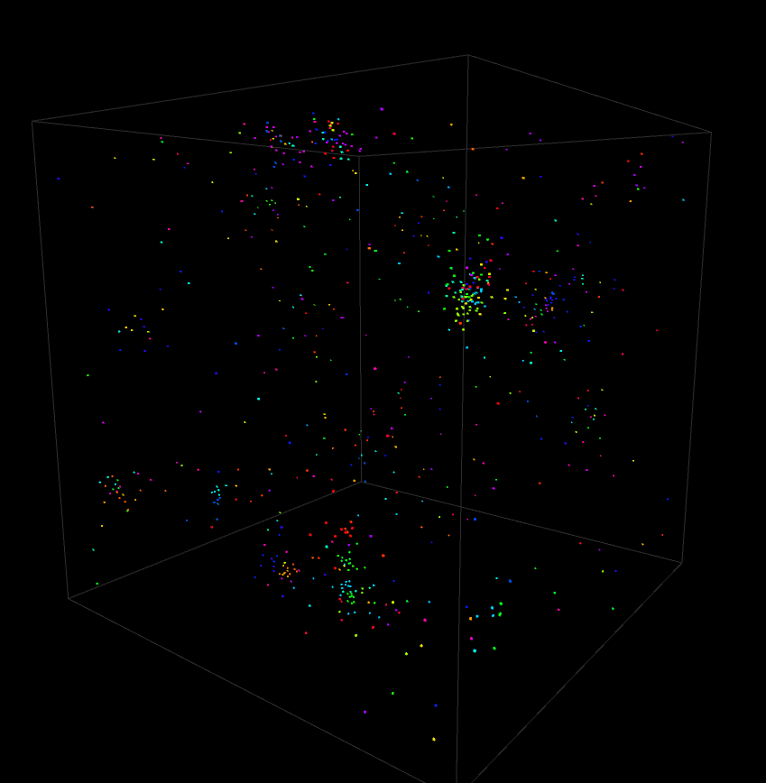
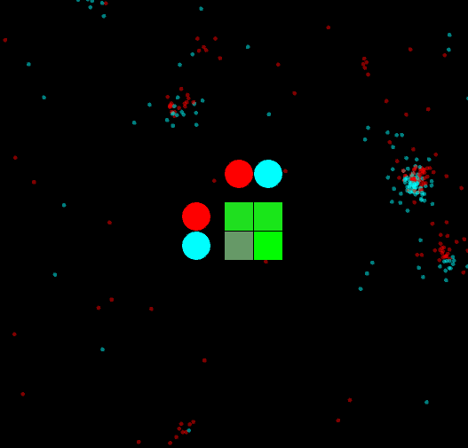
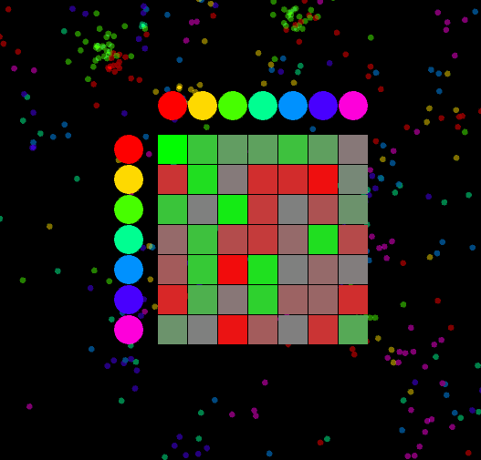
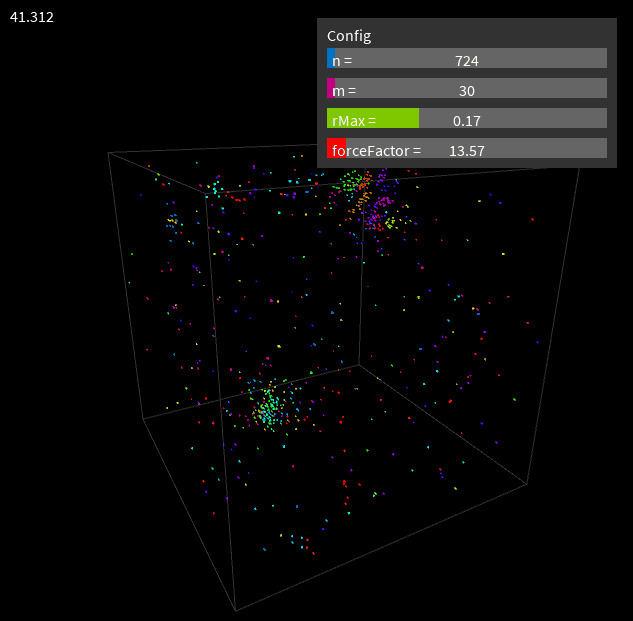

# Particle Life Simulation

## What is Particle Life?

Particle Life is a simulation where particles of different types (colors) interact with each other based on attraction and repulsion forces. The amount a color is attracted or repulsed to another color can be visualized in an attraction matrix (you can see the current by pressing "Space" to toggle into 2D mode).

Here is a 2 by 2 matrix of the colors red and cyan:  

Here is a 7 by 7 matrix!  

With just this one simple rule really cool stuff can happen! :D

## Features

### Optimized with Quadtree

## Controls

### Keybinds

| Key | Action |
|-----|--------|
| `q` | Toggle octree visualization |
| `t` | Toggle world wrapping |
| `p` | Pause/unpause simulation |
| `r` | Reset simulation |
| `Space` | Toggle between 2D and 3D view |
| `-` | Decrease particles by 1000 |
| `=` | Increase particles by 1000 |
| `,` | Decrease particle types by 1 |
| `.` | Increase particle types by 1 |
| `↑` | Decrease interaction radius |
| `↓` | Increase interaction radius |
| `←` | Decrease force strength |
| `→` | Increase force strength |

### 3D View Control
| Control | Action |
|---------|--------|
| `w/a/s/d` | Rotate camera |
| Mouse drag | Rotate camera |
| Mouse wheel | Zoom in/out |

## Sliders

You can use the mouse to drag sliders or use their associated keys.  

- **n (Particles)** - `-` / `=` - Total number of particles in the simulation (changing n resets the simulation)  
- **m (Types)** - `,` / `.` - Number of different particle types (colors)  
- **rMax (Interaction Radius)** - `↑` / `↓` - Maximum distance particles can interact
- **forceFactor (Force Strength)** - `←` / `→` - Multiplier for all interaction forces

